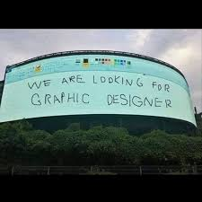

# Politecnico di milano - Hypermedia - 2025 
<p align="left">
  
  
</p>


## Overview
This repository contains all materials for the Web Design Project as part of the HYP 2024-2025 course. It includes design documentation, prototypes, and the final implementation of our web application.

## Figma Prototype
The interactive prototype can be accessed [here](https://www.figma.com/design/grXIBaO2j7GEfZ686v671W/Hyp-App?node-id=0-1&p=f&t=GdOyxDLW52tlILSi-0).

## Nuxt Minimal Starter

Look at the [Nuxt documentation](https://nuxt.com/docs/getting-started/introduction) to learn more.

### Setup

Make sure to install dependencies:

```bash
npm install
```

### Development Server

Start the development server on `http://localhost:3000`:

```bash
npm run dev
```

### Production

Build the application for production:

```bash
npm run build
```

Locally preview production build:

```bash
npm run preview
```

Check out the [deployment documentation](https://nuxt.com/docs/getting-started/deployment) for more information.


## Live Demo
The running application can be accessed [here](https://hmwa-25-git-main-moise7000s-projects.vercel.app/)

## Design Documentation
The design process follows the methodology specified in the course:

1. **Content Design**:
   - C-IDM Schema (content design in the large)
   - Content Tables (content design in the small)

2. **Navigation Design**:
   - Abstract pages with labeled slots for content, links, and orientation info

3. **Presentation Design**:
   - Low-fidelity wireframes
   - High-fidelity wireframes in Figma
   - Interactive prototype with scenarios

4. **Database Design**:
   - ER Schema showing content and relationships

## Final Report
The comprehensive design report follows the required structure:
- Cover page with team information and links
- Table of contents
- Abstract
- C-IDM Diagram
- Content-in-the-small Tables
- Final Commented Screenshots
- Interaction Scenarios
- DB design (ER schema)
- Annex: Abstract Pages

## Team Members
- [Yuto Yamaguchi](mailto:yuto.yamaguchi@mail.polimi.it)
- [Xavier Anicito](mailto:xavierandre.anicito@mail.polimi.it)
- [Ewan Decima](mailto:ewangabriel.decima@mail.polimi.it)


